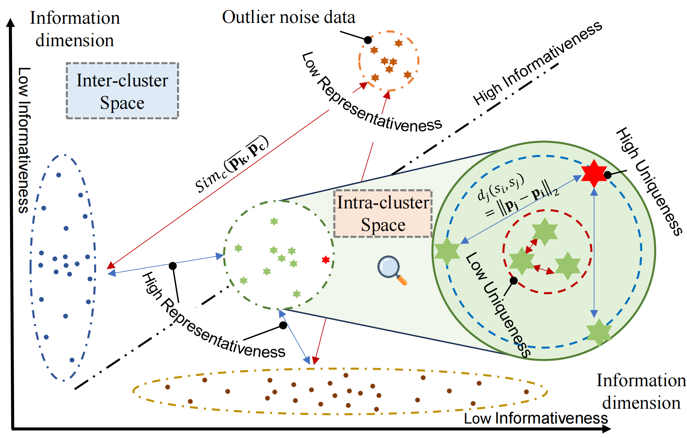
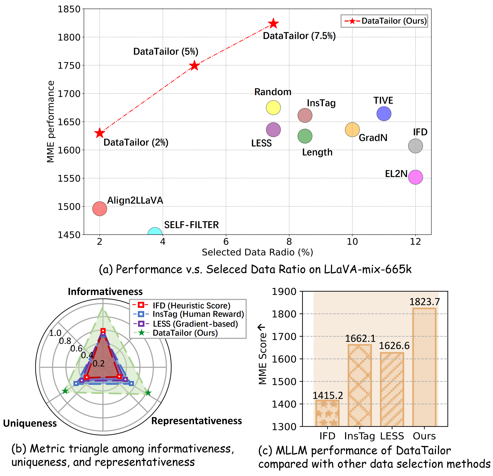

# ✂ DataTailor
Mastering Collaborative Multi-modal Data Selection: A Focus on *Informativeness*, *Uniqueness*, and *Representativeness*
# 🌍 Introduction
 Instruction tuning fine-tunes pre-trained Multi-modal Large Language Models (MLLMs) to handle real-world tasks. However, the rapid expansion of visual instruction datasets introduces data redundancy, leading to excessive computational costs. We propose a collaborative framework, **DataTailor**, which leverages three key principles—--informativeness, uniqueness, and representativeness--—for effective data selection. We argue that a valuable sample should be informative of the task, non-redundant, and represent the sample distribution (i.e., not an outlier). We further propose practical ways to score against each principle, which automatically adapts to a given dataset without tedious hyperparameter tuning. Comprehensive experiments on various benchmarks demonstrate that DataTailor achieves 100.8\% of the performance of full-data fine-tuning with only 15\% of the data, significantly reducing computational costs while maintaining superior results. This exemplifies the ``Less is More" philosophy in MLLM development.

# 💡 Three Core principles

- **Informativeness**: a valuable sample should be informative of the task, e.g., If the task is reasoning, describing the differences in movements between skiing and ice skating is more informative than simply showing someone skiing. *In above Figure where each axis (heuristically) represents an orthogonal dimension of task information, points along the diagonal carry more information about the task.*
- **Uniqueness**: a valuable sample should be distinct from others, exhibiting a large distance from nearby samples to reduce data redundancy (*c.f. Figure near the blue dashed region in the intra-cluster space demonstrate high uniqueness*).
- **Representativeness**: it should be a typical sample in the data distribution. This prevents selecting noisy outliers or mislabeled samples (c.f. *Figure the clusters connected by blue lines in the inter-cluster space exhibit high representativeness for the overall dataset*). 

# ⭐ Highlight & Results

- We identify three key principles~(*i.e.*, informativeness, uniqueness, and representativeness) from a systematic perspective to master multi-modal data selection.
- We propose a unified framework, **DataTailor**, to adaptively integrate these principles for value evaluation to optimize multi-modal data selection in a collaborative way.
- Extensive results show DataTailor's effectiveness in optimizing all three principles during selection and achieving new SOTA performance on various benchmarks.
# 🛠️ Setup Steps
1. Conda a new python environment
    ```
    conda create --name datatailor python=3.10
    conda activate datatailor
    pip install -r requirements.txt
    ```
3. Prepare candidate datasets (1. [MiniGPT4-Instruction](https://github.com/Vision-CAIR/MiniGPT-4/blob/main/dataset/README_2_STAGE.md), 2. [LLaVA-665K](https://huggingface.co/datasets/liuhaotian/LLaVA-Instruct-150K/blob/main/llava_v1_5_mix665k.json), 3. [Mplug-OWL-264K](https://github.com/X-PLUG/mPLUG-Owl/tree/main/mPLUG-Owl), 4. [Bunny-695K](https://huggingface.co/datasets/BoyaWu10/Bunny-v1_0-data/tree/main/finetune))
4. DataTailor framework
   1. informativeness
    ```
    bash datatailor.sh
    ```
   2. cross modal domain clustering
    ```
    python make_clustering.py
    ```
   3. uniqueness and representativeness
    ```
    python relationship_value_calculation.py
    ```
   4. collaborative multi-modal data selection
    ```
    python datatailor_selector.py
    ```
   5. Selected data fine-tuning
    ```
    bash finetune_lora_stage2_7b.sh
    ```
